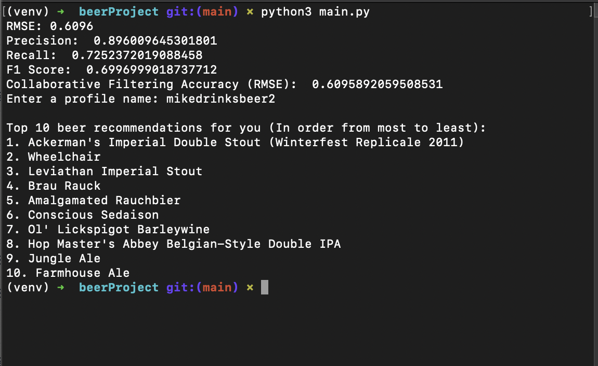

<h1 align="center">Beer Recommender System</h1>


## What is this?

This beer recommender system combines collaborative filtering and content-based filtering techniques to provide personalized beer recommendations.


## How it works?

This code implements a hybrid recommender system for beer recommendations, combining both collaborative filtering and content-based filtering techniques. The collaborative filtering is done using the SVD (Singular Value Decomposition) algorithm from the Surprise library, while the content-based filtering uses the TF-IDF (Term Frequency-Inverse Document Frequency) vectorizer from scikit-learn to find similar beers based on their styles.

Overall, the beer recommendation system is a fun and interactive way for beer lovers to discover new beers they may enjoy based on their preferences


## How Was it Made?

The beer recommendation system was made using Python programming language and several libraries which are included in the requirments(Pandas, NumPy, scikit-learn, random, surprise, etc)

### Requirements:

-Python 3
-pandas
-numpy
-scikit-learn
-Surprise

## How to run

1. Download or clone the repository.
    ```
    git clone [link]
    ```

2. Add Data Set To your repository:

- [beer_reviews.csv](https://data.world/socialmediadata/beeradvocate/workspace/file?filename=beer_reviews.csv)

3. Create a virtual environment (optional, but recommended):

    1. cd into directory
    
    2. Create venv:
            
            python -m venv venv
     
    3. Activate virtual environment
            
        -To Activate on Windows:

            .\venv\Scripts\activate


        -To Activate on Mac:

            source venv/bin/activate

            
4. Activate and install required libraries using requirments.txt
    ```
    pip install -r requirements.txt
    ```

5. Run the main.py file and have fun :)
    ```
    python3 main.py
    ```

6. From CSV file add profile name when prompted and it will give you top 10 recommendations

 ## Demo from Command Line
 

